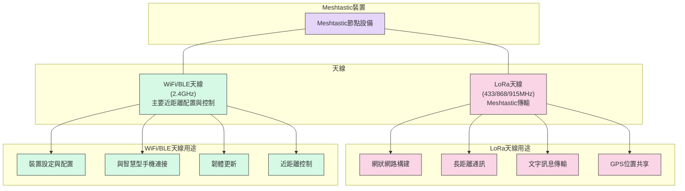

# RF天線工作原理與台灣Meshtastic天線選擇指南

[TOC]

## 前言


在現代無線通訊技術迅速發展的今天，Meshtastic作為一個開源的離網網狀網路專案，已成為許多無線電愛好者、戶外活動家和應急通訊系統建構者的首選工具。然而，對於許多新手來說，理解RF（無線電頻率）天線的工作原理以及如何正確選擇適合台灣環境的天線仍是一個挑戰。本文旨在用簡單易懂的方式解釋RF天線的基本原理，並提供在台灣使用Meshtastic時的天線選擇建議，幫助新手快速入門射頻的領域。

## RF天線的基本工作原理

### 天線是什麼？

天線是無線通訊系統中的關鍵元件，其主要功能是將電路中的電能轉換為空間中的電磁波（發射），或將空間中的電磁波轉換為電路中的電能（接收）。簡單地說，天線就像是無線電通訊中的「嘴巴」和「耳朵」。

### 天線的工作原理

天線的工作原理基於電磁感應和電磁波傳播理論：

1. **發射原理**：當交流電流流過天線導體時，會在天線周圍產生變化的電磁場。這個電磁場會形成電磁波向空間傳播。

2. **接收原理**：當電磁波經過天線導體時，會在導體中感應出交流電流。這個電流隨後被無線電接收器放大和處理。

3. **諧振現象**：天線在特定頻率（諧振頻率）工作時效率最高。這通常與天線的物理長度相關，一般為工作波長的1/4、1/2或整數倍。

### 重要的天線參數

了解天線性能的幾個關鍵參數：

1. **阻抗匹配**：理想情況下，天線的阻抗應與發射機和傳輸線的阻抗匹配（通常為50歐姆），以實現最大能量傳輸。

2. **駐波比（SWR）**：衡量天線系統阻抗匹配程度的指標。理想值為1:1，表示完美匹配；值越大，反射損失越大，系統效率越低。

3. **天線增益**：表示天線在特定方向上的輻射能力，單位為dBi（相對於理想全向天線）或dBd（相對於半波偶極子天線）。

4. **輻射方向圖**：描述天線在不同方向上的輻射強度分布。

5. **頻寬**：天線能有效工作的頻率範圍。

## 台灣Meshtastic頻段與法規

在台灣使用Meshtastic前，了解相關法規非常重要。以下是台灣地區使用Meshtastic可能涉及的頻段及相關規範：

### 可用頻段

根據台灣國家通訊傳播委員會（NCC）的規定，Meshtastic在台灣主要可使用的頻段有：

1. **433 MHz**：低功率射頻電機可在433-434 MHz頻段工作，但有功率限制。
2. **920-925 MHz**：低功率射頻設備可在此頻段工作。
:::warning
台灣目前主要使用923.875MHz
:::

### 功率限制

- 433 MHz頻段：最大發射功率受限制，需遵循NCC低功率射頻電機技術規範。
- 920-925 MHz頻段：同樣需遵守功率限制規定。

### 使用者資格

一般用戶可使用符合NCC低功率射頻電機規範的Meshtastic設備，無需特別執照。但若要使用高功率設備，可能需要業餘無線電執照。

## Meshtastic天線種類及選擇

### 常見天線類型

1. **內置天線**：許多Meshtastic設備自帶小型天線，便於攜帶但範圍有限。

2. **1/4波長天線**：常見的基本天線類型，在433 MHz頻段約為17.3厘米長，915 MHz頻段約為8.2厘米長。

3. **1/2波長天線**：較1/4波長天線效能更好，但尺寸更大。

4. **全向天線**：向各個方向輻射信號，適合移動或多點覆蓋場景。

5. **定向天線（Yagi天線等）**：將能量集中在特定方向，實現更長距離的點對點通訊。

### Meshtastic裝置的雙天線系統

Meshtastic裝置通常配備兩組不同的天線系統，分別用於不同的通訊目的。以下是這兩種天線的功能示意圖：

#### 兩種天線系統的功能與用途

##### LoRa天線（433/868/915 MHz）

- **主要功能**：實現長距離的網狀網路通訊，是Meshtastic的核心功能
- **通訊距離**：在開闊地形可達數公里，甚至數十公里
- **頻段選擇**：依據各國法規，常見頻段為433MHz（亞洲部分地區）、868MHz（歐洲）和915MHz（北美、台灣）
- **應用場景**：戶外活動、偏遠地區通訊、應急通訊、大範圍的物聯網部署
- **數據傳輸**：適合低頻率、小數據量的傳輸，如文字訊息、GPS座標、傳感器數據等

##### WiFi/BLE天線（2.4 GHz）

- **主要功能**：用於近距離設備配置、控制和管理
- **通訊距離**：通常僅數十米以內
- **應用場景**：
  - 通過智慧型手機應用程式設定Meshtastic節點
  - 韌體更新和維護
  - 讀取日誌和診斷信息
  - 與其他智能設備的本地整合
- **特點**：高速短距離通訊，適合配置和調試，但不是Meshtastic核心網狀網路的一部分

在進行Meshtastic部署時，需要合理考慮這兩套天線系統的特性，特別是LoRa天線的選擇對整個網路覆蓋範圍和性能至關重要。而WiFi/BLE天線則主要關注近距離操作的便利性和穩定性。

### 天線選擇考慮因素

在選擇Meshtastic天線時，應考慮以下因素：

1. **頻率匹配**：確保天線設計頻率與您使用的Meshtastic頻段（433 MHz或915 MHz）相符。

2. **使用場景**：
   - 移動使用：選擇小型、輕便的全向天線
   - 固定站點：可考慮性能更好的定向天線
   - 室內使用：高增益全向天線
   - 長距離通訊：高增益定向天線

3. **安裝位置**：天線應安裝在高處，避免被建築物、樹木等障礙物遮擋。

4. **接地平面**：特別是對於1/4波長天線，良好的接地平面可顯著提升性能。

## 天線選擇不當帶來的問題

選擇不適合的天線或使用方式錯誤會帶來一系列問題：

### 1. 通訊距離大幅縮短

不匹配的天線會導致能量損失，信號無法有效輻射或接收，從而顯著縮短通訊距離。例如，使用設計用於433 MHz的天線在915 MHz頻段工作，可能會使通訊距離減少50%甚至更多。

### 2. 傳輸設備損壞風險

嚴重的阻抗失配（高SWR）會導致RF能量反射回發射機而不是輻射出去，這可能會使發射機過**熱甚或損壞**。特別是在使用功率放大器的情況下，此風險更高。

### 3. 網路穩定性降低

天線選擇不當會導致信號質量不穩定，尤其在邊緣覆蓋區域，這會影響Meshtastic網路的整體穩定性和可靠性，可能導致消息丟失或延遲。

### 4. 電池壽命縮短

天線不匹配會導致設備需要更多功率才能實現相同的通訊效果，從而增加能耗，縮短電池壽命。這對於依賴電池運行的Meshtastic節點尤為重要。

### 5. 干擾問題

阻抗不匹配或天線選擇不當可能會產生諧波輻射，造成對其他無線服務的干擾，這不僅違反法規，還會影響自身和他人的通訊質量。

## 實用DIY天線建議與最佳實踐

### 對新手的建議

1. **從基本開始**：初學者可從設備自帶的天線或簡單的1/4波長天線開始，隨著經驗增長再嘗試更複雜的天線設計。

2. **正確安裝**：確保天線垂直安裝，並儘量放在高處，遠離金屬物體和電子設備干擾。

3. **使用SWR計**：如果條件允許，使用SWR計測量天線的駐波比，確保良好的匹配度。理想的SWR值應小於1.5:1。

### DIY天線選項

對於喜歡自己動手的愛好者，有幾種簡單的DIY天線可以考慮：

1. **簡易1/4波長接地平面天線**：使用銅線製作，成本低廉且效果不錯。

2. **J極天線**：稍微複雜但性能更好，無需接地平面。

3. **八木天線**：方向性強，適合長距離點對點通訊。

### 商業天線推薦

如果預算允許，以下是一些適用於Meshtastic的商用天線選擇：

1. **高增益全向天線**：適合作為固定站點的基站天線。

2. **磁力吸附式天線**：適合車載使用。

3. **可折疊便攜天線**：適合戶外活動和緊急情況。

## 結語

選擇合適的天線對於Meshtastic網路的性能至關重要。通過了解RF天線的基本工作原理、
的頻譜法規以及不同場景下的最佳選擇，可以顯著提升您的Meshtastic使用體驗。隨著經驗的積累，您還可以嘗試更多高級天線技術，進一步優化您的網路性能。

記住，最好的天線不一定是最昂貴或最複雜的，而是最適合您特定需求和使用場景的那一個。希望本文能幫助您在射頻天線的領域中邁出第一步，建立高效可靠的Meshtastic網路。

## 參考資源

1. Meshtastic官方文檔：[https://meshtastic.org/docs/hardware/antennas/](https://meshtastic.org/docs/hardware/antennas/)
2. 
3. 

:::info
如有任何問題或建議，歡迎在評論區留言討論！
:::

<!-- 標籤 -->
###### tags: `Meshtastic` `無線通訊` `天線` `LoRa` `網狀網路` `RF` `台灣`
